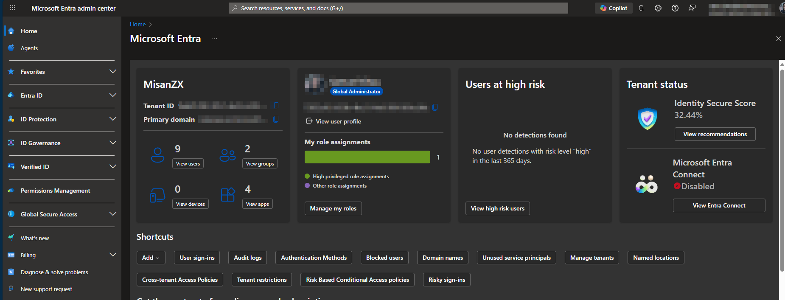
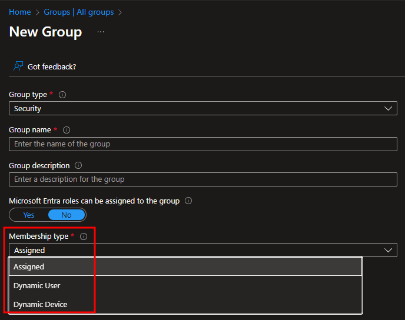
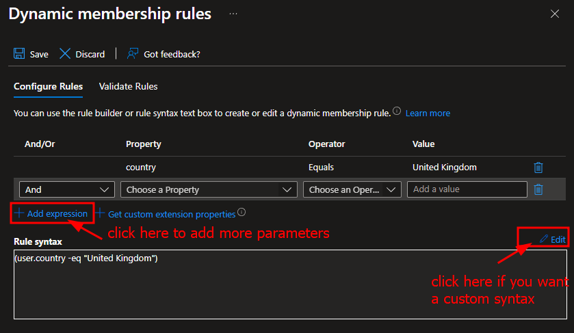
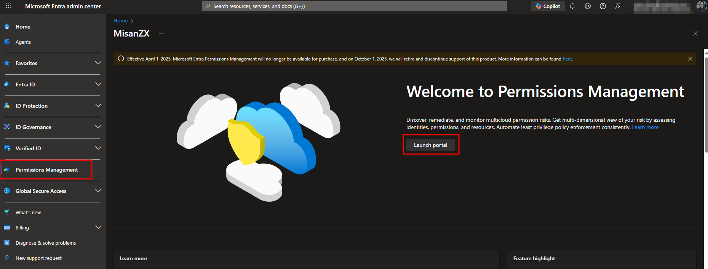
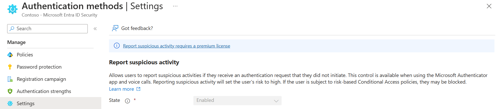

# SC-300
Microsoft Certified: Identity and Access Administrator Associate
Role: Security Engineer

# Introduction
Please note at the time of the documentation I am writing the content may have changed, data may have moved so please refer to the official documentation within Microsoft to see the lastest changes. If this study guide has been helpful, please do show your support and follow me or if you are very generous to donate to kofi page: https://Ko-fi.com/misanzx Thank you

# Useful First Starting Links
- [Study Guide](https://learn.microsoft.com/en-us/credentials/certifications/resources/study-guides/sc-300)
- [MS Learning](https://learn.microsoft.com/en-us/credentials/certifications/identity-and-access-administrator/?practice-assessment-type=certification)

# Other Notes
As of 2025, the most recent changes are Azure AD is now known as Entra ID, if you see any documentation that references this, please be aware they do change the naming from time to time.

# How Do I Learn?
Get an account, its free to sign up as a 30 days free trial and after that, make sure you have set it to not renew which you can still go in to see the blades and follow along with the learning content.
My plan is to go through each section and make sure I understand how to do a specific function and document how to do it.

# MS Entra ID (formerly known as Azure AD)

First Home page when you log into Entra Admin Center

## Manage rules for dynamic membership groups in Microsoft Entra ID
They can only be:
- user-based
- device-based
> [!Note]
> - Max of 15,000 dynamic membership groups in a single tenant.

- In Entra ID
- Expand the Entra ID blade
- Click on Groups then new groups

> [!Tip]
> - When attriutes of a user or a device changes, the system rechecks the all rules for the dynamic membership groups within the director. You cannot manually add or rember a member of a dynamic membership group.

> [!Warning]
> - You can only create dynamic membership groups for one or the other, but you cannot create a rule for both.
> - You cannnot reference user attributes of the device owner. Device membership can only refrence itself.

### License Requirements
You require on of the following licences:
- Microsoft Entra ID P1
- Intune for Education License

> [!Tip]
> - Licenses are only required once for the users, not the devices.

### Rule builder in the Azure portal
MS Entra ID gives you a rule builder to make it easier to create your dynamic grouping.
- Supports up tp 5 expressions
- If it does not support the rule, use the custom rule by adding an expression.

For more information about Dynamic membership groups please go here: https://learn.microsoft.com/en-us/entra/identity/users/groups-dynamic-membership

## Permissions Management
MS Entra Permissions Management is a Cloud Infrastructure Entitlement (CIEM) Solution designed to help provide a comprohensive visability and control over permissions across mutlicloud environments.
- Microsoft Azure
- Amazon Web Services (AWS)
- Google Cloud Platform (GCP)

### Activites within the portal
You can create,view activity alert triggers.

## Microsoft Entra Built-in roles
Roles naming changes from time to time, so please refer to this page for the latest updates.
https://learn.microsoft.com/en-us/entra/identity/role-based-access-control/permissions-reference

## Configuring MS Entra Multifactor Settings (MFA)
The report suspicous activity replaces the Block/unblock users, Fraud alert and Notification legacy features.

### How to investigate?
With a MS P2  or Entra Suite license, go to:
- Entra ID
- User ID Protection

There you can navigte to the .CSV/.JSON report for processing.

### Why is a user at risk?
- They have one or more risky sign-ins.
They have more risks linked to thier account, for example a leaked credential.

Within the MS Entra, under Risky Activities, you can investigate the users report and action them accordingly.

The Risk history tab shows the events that led to a user withint he last 90 days.

It is generally recommended to lower the risk with an admin remediation action such as resetting a password or dismissing the risk if a false positive.

Some information as part of the risk includes:
- Timestamp
- Application
- Device
- Location
- IP address

To assist with this, it is recommened to setup risk-based Conditional Access policies to prevent similar attacks and to lower the risk or address any gaps in coverage.